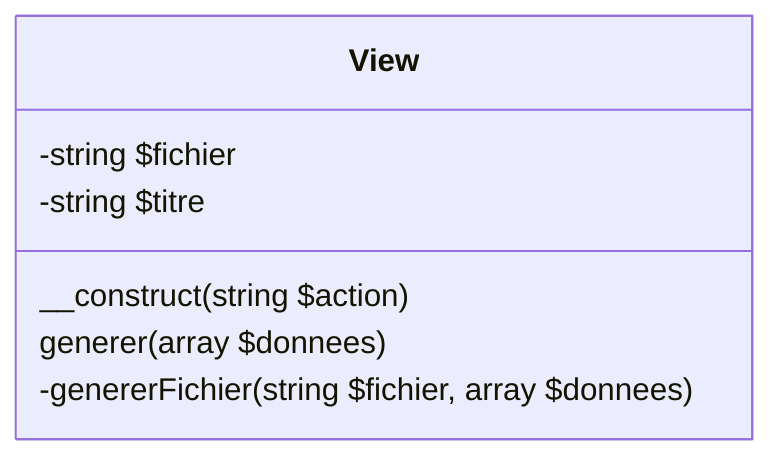
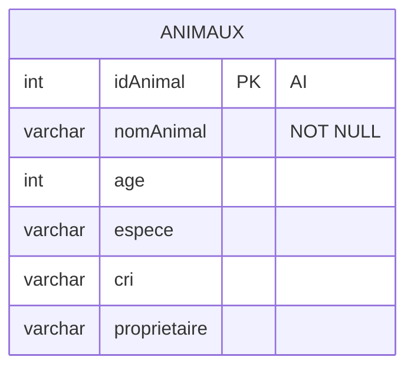
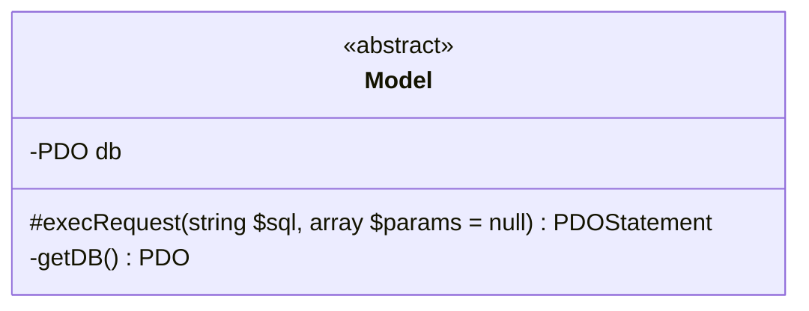

# nyan-cat-project

## PHP TP1 -  Mise en place du projet

Votre mission sera de développer une application Web PHP pour gérer une animalerie.
Vous devrez gérer les actions pour manager vos animaux ainsi que leurs propriétaires.
Pour ajouter de la structure au projet, nous allons travailler avec un design pattern : Le MVC (Model-View-Controller).
[Voir détails](https://fr.wikipedia.org/wiki/Modèle-vue-contrôleur)

### 1 - Mise en place de l'architecture des dossiers

Dans votre dossier de travail (Bureau, Dossier XAMP, ...) vous allez créer un premier fichier index.php
Il servira de point d'entrée de votre application. Nous allons ensuite créer quelques dossiers.

```html
📦 TonSuperProjet
┣ 📂controllers
┣ 📂models
┣ 📂public
┃ ┣ 📂css
┃ ┗ 📂img
┣ 📂views
┣ 📜index.php
```

### 2 - Gérer la partie V du MVC

**2.1 :** Pour gérer l'affichage de nos pages, nous allons créer une classe View dans le fichier views/View.php. (Cette notation implique de créer le fichier View.php dans le dossier views).
Voici le diagramme de notre classe



**2.2 :** Implémenter les méthodes des View :

- Methode __construct

```php
public function __construct(string $action) {
  // Détermination du nom du fichier vue à partir de l'action
  $this->fichier = "views/vue" . $action . ".php";
  $this->titre = $action;
}
```

- Methode generer

```php
// Génère et affiche la vue
public function generer(array $donnees) {
  // Génération de la partie spécifique de la vue
  $contenu = $this->genererFichier($this->fichier, $donnees);
  // Génération du gabarit commun utilisant la partie spécifique
  $vue = $this->genererFichier('views/gabarit.php',
    array('titre' => $this->titre, 'contenu' => $contenu));
  // Renvoi de la vue au navigateur
  echo $vue;
}
```

- Methode genererFichier

```php
// Génère un fichier vue et renvoie le résultat produit
private function genererFichier(string $fichier, array $donnees) {
  if (file_exists($fichier)) {
    // Rend les éléments du tableau $donnees accessibles dans la vue
    // Voir la documentation de extract
    extract($donnees);
    // Démarrage de la temporisation de sortie
    ob_start();
    // Inclut le fichier vue
    // Son résultat est placé dans le tampon de sortie
    require $fichier;
    // Arrêt de la temporisation et renvoi du tampon de sortie
    return ob_get_clean();
  }
  else {
    throw new Exception("Fichier '$fichier' introuvable");
  }
}
```

Si vous avez des questions de compréhension, n'hésitez pas à vous référer aux commentaires et à en discuter avec votre prof.
Si vous analysez bien le code, il fait références à 2 types de fichiers.

- Les fichiers vue{qqchose}.php que nous verrons plus tard
- Le fichier gabarit.php que nous allons voir maintenant sur

**2.3 :** Le fichier gabarit sert à représenter tout ce qui est présent en permanence sur notre page (menu, pied de page, logo, ...). C'est celui-ci qui chargerait notre css, js et autre dépendances dans la balise head.

Pour commencer créer un fichier views/gabarit.php. Celui-ci aura accès grâce a la classe View à 2 variables :

- $titre -> Contient la valeur pour la balise title
- $contenu -> Contient tout le code de notre page

Je vais vous proposer un squelette pour votre gabarit. Il sera à compléter avec votre structure (menu par exemple), mais aussi avec les variables pour placer le contenu ou vous le désirer.
Vous pouvez faire votre propre gabarit si besoin.

```html
<!doctype html>
<html lang="fr">

<head>
    <meta charset="UTF-8"/>
    <link rel="stylesheet" href="public/css/main.css"/>
    <meta name="viewport" content="width=device-width, initial-scale=1">
    <title><?= $titre ?></title>
</head>

<body>
<header>
    <!-- Menu -->
    <nav>
    
    </nav>
</header>
<!-- #contenu -->
<main id="contenu">

</main> 
<footer>

</footer>
</body>

</html>
```

Si vous êtes observateur, vous remarquerez une référence à un fichier css. Je vous recommande de le créé pour styliser votre page (📝 et oui le css compte dans la note).

Vous pourrez aussi voir comment affichier le contenu d'une variable vu que le titre est affiché dans la balise title. A vous d'afficher le contenu.

**2.4 :** Pour notre page d'accueil, nous allons faire simple. Du moins pour le moment, pour avoir une preuve que tout fonctionne
Créez le fichier views/vueIndex.php avec du code simple

```php
<h1>Bienvenue chez <?= $nomAnimalerie ?></h1>
```

Ce sera tout pour la vue pour le moment

### 3 - Gérer le controleur pour afficher la vue

Il est grand temps d'afficher quelque chose ! Mais pour cela, il nous faudra un chef d'orchestre ! Le controleur à la rescousse.

**3.1 :** Nous allons créer une classe MainController dans le fichier controllers/MainController.php
Pour le moment, il ne fera pas grand chose d'autre que construire notre vue. **N'oubliez pas de require_once votre classe View !!**

**3.2 :** Ajoutons une fonction Index qui aura pour but de génerer notre vue.

```php
public function Index() : void {
    $indexView = new View('Index');
    $indexView->generer(['nomAnimalerie' => "NyanCat"]);
}
```

Prenez bien le temps de comprendre ce que fait cette fonction. Et surtout que les paramètres ne sont pas choisis au hazard ;)

**3.3 :** Pour finaliser notre controleur, nous devons nous reposer sur un autre composant (souvent dans l'ombre) => Le router.

Celui-ci sera EXTREMEMENT simple au début. Au fur et à mesure du développement de l'application, il faudra faire attention à ce que ce dernier reste le plus clean possible.

Cette fois, pas besoin de créer un fichier, nous allons utiliser notre index.php.
Pour tester que tout marche, il nous suffit d'instancier un MainController et d'en appeler sa méthode Index(). (⚠ require_once ⚠)

Si tout vas bien, votre page devrait s'afficher avec notre h1 !

### 4 : Fin du TP1 et bonus

À la fin, ton arborescence devrait ressembler à cela

```html
📦 TonSuperProjet
 ┣ 📂controllers
 ┃ ┗ 📜MainController.php
 ┣ 📂models
 ┣ 📂public
 ┃ ┣ 📂css
 ┃ ┃ ┗ 📜main.css
 ┃ ┗ 📂img
 ┣ 📂views
 ┃ ┣ 📜gabarit.php
 ┃ ┣ 📜View.php
 ┃ ┗ 📜vueIndex.php
 ┗ 📜index.php
```

En bonus : Commencez dès maintenant votre CSS en gérant un menu avec des bouton factice dans la balise nav de votre Gabarit !!

## PHP TP2 -  Stocker et afficher les données

### Coté base de données

**1.1 :** Vous devriez avoir accès à une base de donnée MySQL (via grp ou bien XAMPP). Regardez la procédure pour acceder à votre outil PhPMyAdmin. Cela nous servira à administrer la base de donnée. (PhPMyAdmin n'est pas obligatoire, utiliser un autre moyen comme mysqm-cli, Datagrip ou bien MySQLWorkbench peut très bien fonctionner). Connectez vous à votre SGBD et selectionnez la bonne base de données. Nous sommes prêt à commencer!

**1.2 :** Nous allons pour le moment nous contenter d'une seule entité pour représenter nos animaux. Nous allons donc créer une table qui suit ce schémas :



Je vous invite à bien utiliser UTF-8 (utf8_general_ci par exemple) pour éviter les soucis d'accents. De plus, veillez à utiliser InnoDB comme moteur pour votre table. Nous pourrons en avoir besoin plus tard.

Essayez d'insérer un animal avec des données cohérentes que nous pourrons afficher plus tard sur notre page web.

**1.3 :** Il est temps de repasser sur notre projet PHP. Créez le fichier models/Model.php suivant ce schémas :



Il vous faudra coder la fonction getDB -> Cette fonction à pour but d'instancier un objet PDO avec les infos de connexion dans l'attribut $db s'il n'est pas null. Puis, elle retournera simplement l'attribut $db. N'hesitez à vous référer à votre cours et à la doc pour l'instance de PDO

Pour la fonction execRequest, celli à pour objectif d'éxecuter la requête $sql passé en paramètre. Elle pourra être préparé et executé avec les $params s'ils existent (👀 $params à une valeur par défaut). Notre fonction retournera le résultat de la fonction execute de PDO (qui est un PDOStatement).

Un peu d'aide => Voici un exemple de paramètre que notre fonction pourrait recevoir :

```php
$sql = 'select * from T_COMMENTAIRE where BIL_ID=?';
$commentaires = $this->executerRequete($sql, array($idBillet));
```
