# nyan-cat-project

# PHP TP1 -  Mise en place du projet

Votre mission sera de développer une application Web PHP pour gérer une animalerie.
Vous devrez gérer les actions pour manager vos animaux ainsi que leurs propriétaires.
Pour ajouter de la structure au projet, nous allons travailler avec un design pattern : Le MVC (Model-View-Controller).
[Voir détails](https://fr.wikipedia.org/wiki/Modèle-vue-contrôleur)

## 1 - Mise en place de l'architecture des dossiers

Dans votre dossier de travail (Bureau, Dossier XAMP, ...) vous allez créer un premier fichier index.php
Il servira de point d'entrée de votre application. Nous allons ensuite créer quelques dossiers.

```html
📦 TonSuperProjet
┣ 📂controllers
┣ 📂models
┣ 📂public
┃ ┣ 📂css
┃ ┗ 📂img
┣ 📂views
┣ 📜index.php
```

## 2 - Gérer la partie V du MVC

**2.1 :** Pour gérer l'affichage de nos pages, nous allons créer une classe View dans le fichier views/View.php. (Cette notation implique de créer le fichier View.php dans le dossier views).
Voici le diagramme de notre classe


**2.2 :** Implémenter les méthodes des View :

- Methode __construct

```php
public function __construct(string $action) {
  // Détermination du nom du fichier vue à partir de l'action
  $this->fichier = "views/vue" . $action . ".php";
  $this->titre = $action;
}
```

- Methode generer

```php
// Génère et affiche la vue
public function generer(array $donnees) {
  // Génération de la partie spécifique de la vue
  $contenu = $this->genererFichier($this->fichier, $donnees);
  // Génération du gabarit commun utilisant la partie spécifique
  $vue = $this->genererFichier('views/gabarit.php',
    array('titre' => $this->titre, 'contenu' => $contenu));
  // Renvoi de la vue au navigateur
  echo $vue;
}
```

- Methode genererFichier

```php
// Génère un fichier vue et renvoie le résultat produit
private function genererFichier(string $fichier, array $donnees) {
  if (file_exists($fichier)) {
    // Rend les éléments du tableau $donnees accessibles dans la vue
    // Voir la documentation de extract
    extract($donnees);
    // Démarrage de la temporisation de sortie
    ob_start();
    // Inclut le fichier vue
    // Son résultat est placé dans le tampon de sortie
    require $fichier;
    // Arrêt de la temporisation et renvoi du tampon de sortie
    return ob_get_clean();
  }
  else {
    throw new Exception("Fichier '$fichier' introuvable");
  }
}
```

Si vous avez des questions de compréhension, n'hésitez pas à vous référer aux commentaires et à en discuter avec votre prof.
Si vous analysez bien le code, il fait références à 2 types de fichiers.

- Les fichiers vue{qqchose}.php que nous verrons plus tard
- Le fichier gabarit.php que nous allons voir maintenant sur

**2.3 :** Le fichier gabarit sert à représenter tout ce qui est présent en permanence sur notre page (menu, pied de page, logo, ...). C'est celui-ci qui chargerait notre css, js et autres dépendances dans la balise head.

Pour commencer créer un fichier views/gabarit.php. Celui-ci aura accès grâce a la classe View à 2 variables :

- $titre -> Contient la valeur pour la balise title
- $contenu -> Contient tout le code de notre page

Je vais vous proposer un squelette pour votre gabarit. Il sera à compléter avec votre structure (menu par exemple), mais aussi avec les variables pour placer le contenu ou vous le désirer.
Vous pouvez faire votre propre gabarit si besoin.

```html
<!doctype html>
<html lang="fr">

<head>
    <meta charset="UTF-8"/>
    <link rel="stylesheet" href="public/css/main.css"/>
    <meta name="viewport" content="width=device-width, initial-scale=1">
    <title><?= $titre ?></title>
</head>

<body>
<header>
    <!-- Menu -->
    <nav>
    
    </nav>
</header>
<!-- #contenu -->
<main id="contenu">

</main> 
<footer>

</footer>
</body>

</html>
```

Si vous êtes observateur, vous remarquerez une référence à un fichier css. Je vous recommande de le créé pour styliser votre page (📝 et oui le css compte dans la note).

Vous pourrez aussi voir comment afficher le contenu d'une variable vu que le titre est affiché dans la balise title. A vous d'afficher le contenu.

**2.4 :** Pour notre page d'accueil, nous allons faire simple. Du moins pour le moment, pour avoir une preuve que tout fonctionne
Créez le fichier views/vueIndex.php avec du code simple

```php
<h1>Bienvenue chez <?= $nomAnimalerie ?></h1>
```

Ce sera tout pour la vue pour le moment

## 3 - Gérer le controleur pour afficher la vue

Il est grand temps d'afficher quelque chose ! Mais pour cela, il nous faudra un chef d'orchestre ! Le contrôleur à la rescousse.

**3.1 :** Nous allons créer une classe MainController dans le fichier controllers/MainController.php
Pour le moment, il ne fera pas grands chose d'autre que construire notre vue. **N'oubliez pas de require_once votre classe View !!**

**3.2 :** Ajoutons une fonction Index qui aura pour but de générer notre vue.

```php
public function Index() : void {
    $indexView = new View('Index');
    $indexView->generer(['nomAnimalerie' => "NyanCat"]);
}
```

Prenez bien le temps de comprendre ce que fait cette fonction. Et surtout que les paramètres ne sont pas choisis au hazard ;)

**3.3 :** Pour finaliser notre contrôleur, nous devons nous reposer sur un autre composant (souvent dans l'ombre) => Le router.

Celui-ci sera EXTREMEMENT simple au début. Au fur et à mesure du développement de l'application, il faudra faire attention à ce que ce dernier reste le plus clean possible.

Cette fois, pas besoin de créer un fichier, nous allons utiliser notre index.php.
Pour tester que tout marche, il nous suffit d'instancier un MainController et d'en appeler sa méthode Index(). (⚠ require_once ⚠)

Si tout vas bien, votre page devrait s'afficher avec notre h1 !

## 4 : Fin du TP1 et bonus

À la fin, ton arborescence devrait ressembler à cela

```html
📦 TonSuperProjet
 ┣ 📂controllers
 ┃ ┗ 📜MainController.php
 ┣ 📂models
 ┣ 📂public
 ┃ ┣ 📂css
 ┃ ┃ ┗ 📜main.css
 ┃ ┗ 📂img
 ┣ 📂views
 ┃ ┣ 📜gabarit.php
 ┃ ┣ 📜View.php
 ┃ ┗ 📜vueIndex.php
 ┗ 📜index.php
```

En bonus : Commencez dès maintenant votre CSS en gérant un menu avec des boutons factice dans la balise nav de votre Gabarit !!

# PHP TP2 - Stocker et afficher les données

## Coté base de données

**1.1 :** Vous devriez avoir accès à une base de donnée MySQL (via grp ou bien XAMPP). Regardez la procédure pour accéder à votre outil PhPMyAdmin. Cela nous servira à administrer la base de donnée. (PhPMyAdmin n'est pas obligatoire, utiliser un autre moyen comme mysqm-cli, Datagrip ou bien MySQLWorkbench peut très bien fonctionner). Connectez vous à votre SGBD et selectionnez la bonne base de données. Nous sommes prêt à commencer!

**1.2 :** Nous allons pour le moment nous contenter d'une seule entité pour représenter nos animaux. Nous allons donc créer une table qui suit ce schéma :


Je vous invite à bien utiliser UTF-8 (utf8_general_ci par exemple) pour éviter les soucis d'accents. De plus, veillez à utiliser InnoDB comme moteur pour votre table. Nous pourrons en avoir besoin plus tard.

Essayez d'insérer un animal avec des données cohérentes que nous pourrons afficher plus tard sur notre page web.

## Coté code

**2.1 :** Il est temps de repasser sur notre projet PHP. Créez le fichier models/Model.php suivant ce schéma :


Il vous faudra coder la fonction getDB -> Cette fonction à pour but d'instancier un objet PDO avec les infos de connexion dans l'attribut $db s'il n'est pas null. Puis, elle retournera simplement l'attribut $db. N'hésitez à vous référer à votre cours et à la doc pour l'instance de PDO

Pour la fonction execRequest, celle-ci à pour objectif d'exécuter la requête $sql passé en paramètre. Elle pourra être préparée et exécutée avec les $params s'ils existent (👀 $params à une valeur par défaut). Notre fonction retournera le résultat de la fonction execute de PDO (qui est un PDOStatement).

Un peu d'aide => Voici un exemple de paramètre que notre fonction pourrait recevoir :

```php
$sql = 'select * from T_COMMENTAIRE where BIL_ID=?';
$commentaires = $this->executerRequete($sql, array($idBillet));
```

**2.2 :** Il est temps de créer notre entité avec son manager ! Voici le diagramme de nos classes models/Animal.php et models/AnimalManager.php

```mermaid
classDiagram
direction LR
class Animal{
    -int $idAnimal
    -string $nom
    -?string $proprietaire
    -?string $espece
    -?string $cri
    -?int $age
}
class AnimalManager{
    getAll() Array~Animal~
    getByID(int $idAnimal) Animal
}
Model <|-- AnimalManager : hérite
Animal <.. AnimalManager : dépend
```



Comme les attributs de la classe Animal sont privés. Vous ajouterez les Getter & Setter associé.

```text
Si vous voulez implémenter l'Hydratation dès maintenant, ne vous genez pas ;) 
Cela sera demandé plus tard dans tous les cas.
```

Il vous faudra implémenter les méthodes getAll et getByID de la classe AnimalManager. Elles ont pour vocation d'utiliser la méthode execRequest pour récupérer les données de la BD et les transformer soit en array d'Animal soit juste en un Animal (getByID ne pouvant retourner évidemment qu'une valeur sinon null)

**2.3 :** Maintenant que nous avons toutes nos armes pour récupérer la donnée, il faut que le controllers les récupère pour les envoyer à la vue et enfin les afficher o/

Pour tester que tout marche, faite une instance du manager dans la fonction Index. Sauvegarder dans 3 variables différentes le retour des fonctions getAll(), getByID(idQuiExiste) et getByID(idQuiNexistePas).

Et pour finir passez les à votre vue Index généré et allez var_dump ces variables dans le fichier vueIndex.php.

Vous devriez avoir une liste, un animal, et null si tout s'est déroulé correctement (dans un format d'affichage moche au possible ;) ).

Code vueIndex.php

```php
<?php var_dump($listAnimals); ?>

<?php var_dump($first); ?>

<?php var_dump($other); ?>
```

Affichage Moche :

```text
object(Animal)#6 (6) { ["idAnimal":"Animal":private]=> int(1) ["nom":"Animal":private]=> string(6) "TheOne" ["proprietaire":"Animal":private]=> string(9) "Lui même" ["espece":"Animal":private]=> string(4) "Dieu" ["cri":"Animal":private]=> NULL ["age":"Animal":private]=> int(99999) } 
object(Animal)#5 (6) { ["idAnimal":"Animal":private]=> int(1) ["nom":"Animal":private]=> string(6) "TheOne" ["proprietaire":"Animal":private]=> string(9) "Lui même" ["espece":"Animal":private]=> string(4) "Dieu" ["cri":"Animal":private]=> NULL ["age":"Animal":private]=> int(99999) } 
NULL
```

## Coté design

**3.1 :**: Il est grand temps de rendre cet affichage un peu plus classe. Sur notre page Index, faite afficher un tableau HTML avec les données de nos animaux !

```text
Vous êtes libre d'utiliser une librairie pour le CSS ou de le coder vous même. 
```

**3.2 :** Nous allons préparer l'avenir de notre tableau. Pour cela, il faudra ajouter une colonne avec comme entête "Option". Nous pourrons alors pour chaque ligne, ajouté un lien représenté par soit un texte, une icône, un bouton, ... . Ces derniers permettront de modifier ou supprimer un animal !

### Exemple avec Materialize


Bien joué si vous êtes toujours en vie jusqu'ici :D

## Coté Bonus (Difficile)

Il y a de grande chance que vous ayez fait votre chaine de connexion à la base de donnée directement dans votre instance de PDO. Ce qui signifierai une faille de sécurité si votre code source se retrouvait exposé (par exemple sur github).

Je vous propose d'essayer de remédier à ce problème en externalisant ces infos dans un autre fichier qui pourrait être une classe Config par exemple.

Celle-ci pourrait charger les informations à l'aide d'un fichier de configuration .ini

Pour vous aiguiller, regarder la doc de la fonction parse_ini_file.

Voici un exemple de fichier dev.ini

```ini
;config dev
[DB]
dsn = 'mysql:host=localhost;dbname=yourdbname;charset=utf8';
user = 'user';
pass = 'password';
```

Ainsi, vous n'aurez qu'à gitignore votre dev.ini et mettre un dev_sample.ini avec des informations standard. L'utilisateur voulant utiliser votre projet n'aura qu'à mettre ses infos ici et renommer le fichier (Très utile pour le partage ou le déploiement)

# PHP TP3 -  Naviguer entre les pages moussaillons

Nous affichons notre page d'accueil ! Mais nous sommes encore bien statiques. Il est grand temps de pouvoir naviguer entre nos pages !

Petit point théorique : Nous pourrions naviguer entre des pages PHP genre index.php puis addAnimal.php etc etc. Ce n'est pas vraiment le comportement que nous voudrions. Voici le comportement voulu.

index.php -> regarder les paramettres url (surtout pages par exemples) -> Suivant ce paramètre, on choisis la fonction du controlleur qui correspond -> Celui génère la vue (avec accès au model si besoin).

Par exemple : index.php?action=updateAnimal&idAnimal=5 -> On voudra donc faire l'action updateAnimal avec comme info l'idAnimal 5 (qui nous permettrais de pré-remplir un formulaire).

## 1 - Ajouter des liens dans la page

**1.1 :** Vous allez devoir créer un menu avec des liens. (Vous avez peut être déjà commencé dans le TP1). Ces liens feront tous références à index.php. Il seront accompagné d'un paramètre que nous appelleront action.

```text
Votre menu devrait apparaitre sur toute les pages
```

Pour le moment, nous allons créer 4 liens :

- action = add-animal
- action = add-proprietaire
- action = search
- un lien vers index sans page pour retourner sur l'index

```text
Vous êtes libre du style CSS de votre menu,
mais celui-ci devrait avoir du sens
```

**1.2 :** Si vous vous souvenez, au TP 2, vous avez ajouté une colonne avec des actions à coté de vos animaux. Pour chaque lignes, vous ajouterez un lien (qui peut être un bouton, une icone, un texte, ...) avec les cibles suivante :

- action = edit-animal & idAnimal = *l'id de l'animal*
- action = del-animal & idAnimal = *l'id de l'animal*

N'hésitez à regarder plus haut l'url que j'ai proposé en exemple pour l'écrire correctement.

Normalement, si tout est correct, vos liens ramènes tous sur la page actuelle. Seul l'url devrait changer.

## Afficher différentes pages suivant l'url

**2.1 :**  Notre objectif, pour commencer, sera de créer des pages ultra simple juste pour attester que le changement fonctionne. Pour cela, travaillons dans notre dossier views.

Créez les différents fichier php qui correspondront aux vue suivantes :

- add-animal (vueAddAnimal.php)
- add-proprietaire (vueAddProprietaire.php)
- search

Ces fichiers ne contiendront qu'un H1 qui exprime leur nom (ce qui nous permettra de vérifier que nous sommes sur la bonne page).

**2.2 :** Il est temps de nous attaquer à l'aiguillage qui indiquera quelle fichier générer, le routeur ! Si vous vous souvenez, c'est notre fichier index.php qui nous sert de routeur. Et nous resteront comme cela pour le moment.

Actuellement, nous ne faisont que charger notre MainControlleur puis appeler sa méthode Index. Hors, ce comportement serait uniquement celui par défaut, c'est à dire sans infos sur la page demandé. En restant simple, avec une structure if/else, nous pouvons regarder la valeur dans la variable page ($_GET sera votre ami !) si elle existe évidemment ;).

Testez les différentes valeurs attendu (vous pouvez laisser les corps des if/else if vides) et appeler Index dans le else.

Si tout fonctionne, rien ne devrait changer.

**2.3 :** Il est temps d'ajouter un routage complet ! Prenons add-animal par exemple. Nous pouvons avoir un AnimalController qui gère tout ce qui traite des animaux directement.

Créez donc une fonction AddAnimal() dans le controleur. Celle-ci n'aura pour but que d'afficher notre page AddAnimal. N'hésitez à regarder comment générer la View dans la fonction Index de MainController.

Puis pour terminer, instanciez votre AnimalController dans index.php, puis appelez AddAnimal() dans le if correspondant.

Si vous cliquez sur votre lien d'ajout d'animal, cela devrait changer de page !

**2.4 :** Nous arrivons à nos fins ! Il est temps de faire la même chose pour les différentes pages. Search devrait utiliser le MainController vu qu'elle est générique. AddPropriétaire pourrait avoir son propre controlleur.

Si tout s'est bien passé, vous devriez pouvoir naviger dans votre site (n'oubliez pas d'avoir un moyen de revenir à l'index dans votre gabarit !!)

**2.5 :** Vous avez peut être remarqué, mais il y a des actions qui n'ont pas de pages. Celle-ci ont pour vocation une action (supprimer un animal par exemple) puis de rediriger vers une page (exemple : l'index). Il nous reste donc à gérer les actions update et delete.

Pour le moment, Delete ne fera que rediriger vers l'accueil. Petite différence cependant, quand la vue sera générée, elle prendra un paramètre en plus dans son Array de variable. Celle-ci s'appelelrais message et contiendrait un texte qui confirme la suppression.

Pour Update, elle redirigera sur la page d'ajout animal. Elle aura juste accès en données GET à l'ID de l'animal, ce qui permettra plus tard de faire la différence entre ajout & update dans le formulaire

## 3 : Construire nos pages

**3.1 :** Attaquons donc notre page d'ajout d'animal ! Celle-ci devrait contenir juste un formulaire nous permettant de créer un animal en base de donnée. A vous de jouer ! (Evidemment, à ce stade, le formulaire ne fera rien !)

```text
Comme toujours, un peu de CSS serait appréciable 
(Qui a dis évaluable :o ?)
```

**3.2 :** La page d'ajout du propriétaire est très similaire a celle d'ajout d'animal. Un simple formulaire. Mais comme nous n'avons pas encore défini de modèle, un simple champs texte pour son nom suffira ;).
